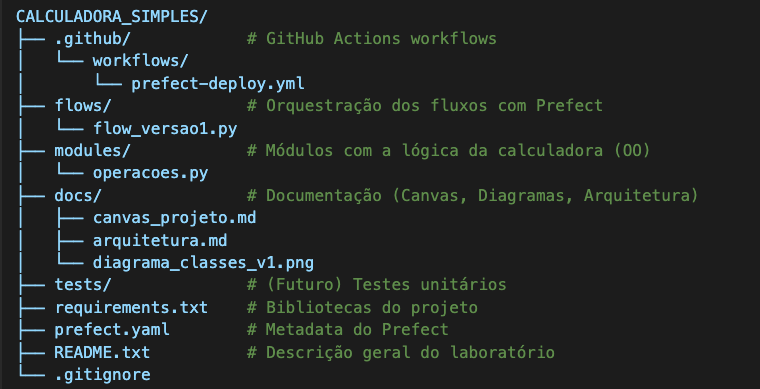

### 🏛️ Arquitetura da Solução — Calculadora Simples Orquestrada

Este documento descreve a arquitetura inicial do projeto, considerando modularização, escalabilidade e facilidade de manutenção.

#### 🎯 Princípios da Arquitetura

- __Modularidade:__ Cada responsabilidade está isolada em um módulo específico, facilitando manutenção e expansão.
- __Orientação a Objetos (OO):__ As operações matemáticas serão implementadas por meio de classes, favorecendo encapsulamento e reutilização.
- __Separação de responsabilidades:__ Lógica de negócios, orquestração e infraestrutura são organizadas de forma independente.
- __Orquestração profissional:__ O uso do Prefect e GitHub Actions permitirá deploys contínuos e automatizados à medida que novas funcionalidades forem desenvolvidas.

---

#### 📁 Estrutura de Diretórios

#### 🔧 Justificativas Arquiteturais

Separação de responsabilidades: Cada camada (módulo, orquestração, documentação) atua de forma independente e bem definida.

__Reprodutibilidade:__ Estrutura padronizada que pode ser reutilizada em outros projetos.

__Escalabilidade:__ Facilita adição de funcionalidades e integrações futuras (ex: API ou interface web).

__Orquestração clara:__ Com Prefect, é possível rastrear e programar execuções com robustez.

__Nota:__ _Considerações Finais_
Essa estrutura serve como modelo didático e também profissional para aplicações que crescem em etapas, com processos integrados de versionamento e automação de deploy.
